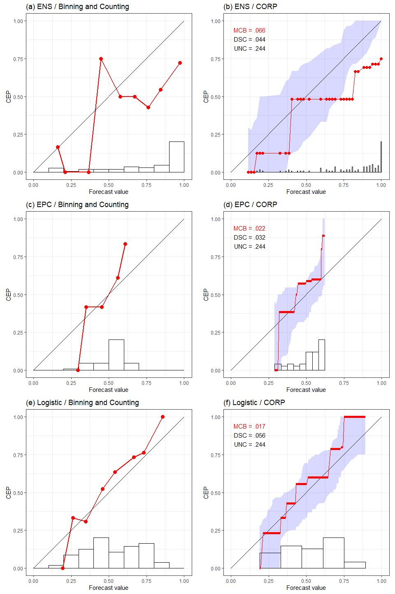
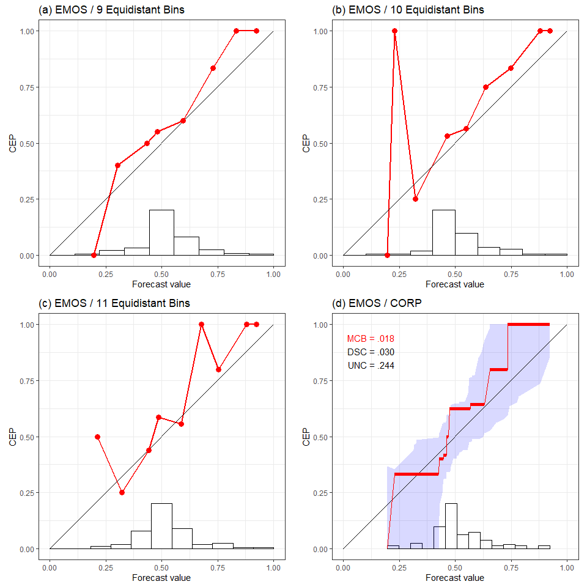
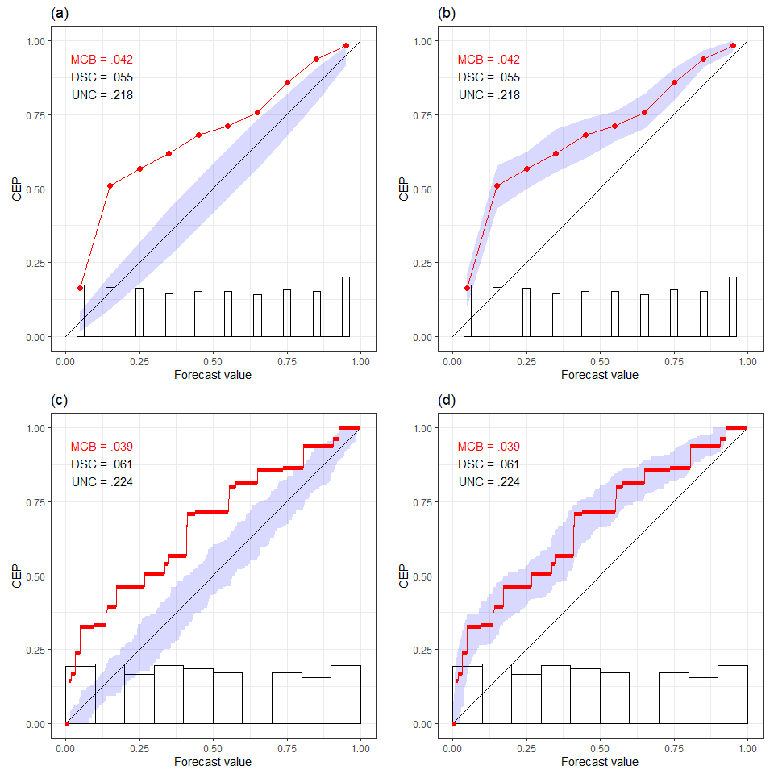
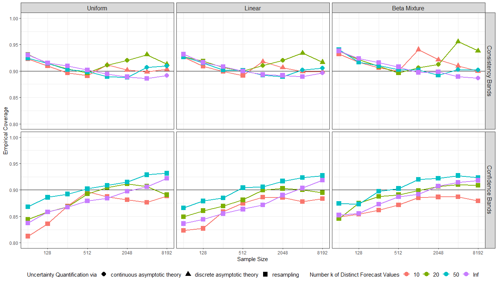
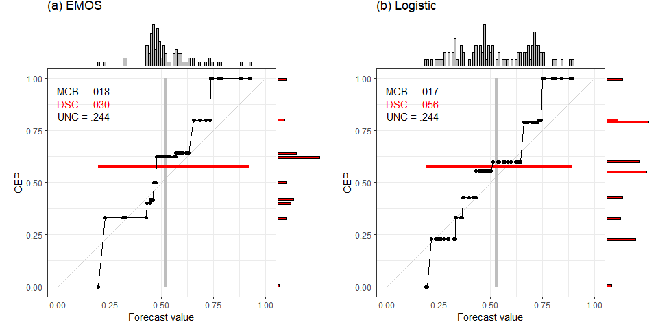
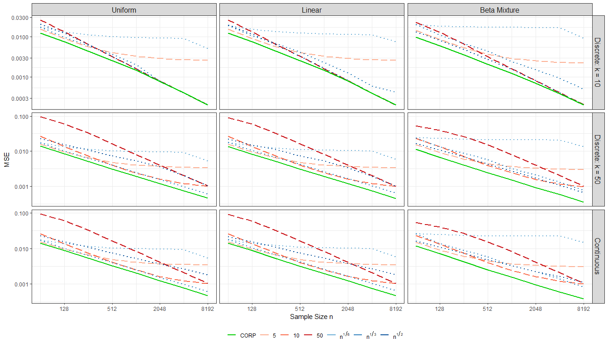

Plots in Main Article
================

## Install packages

Install the `reliabilitydiag` package located in the root directory. The
`here` package identifies that directory by the location of the
replication\_DGJ20.Rproj file.

``` r
install.packages("here")
install.packages("devtools")
devtools::install_local(here::here("reliabilitydiag_0.1.1.tar.gz"))
```

### Required packages and compilation environment

``` r
library(here)
library(reliabilitydiag)
library(dplyr)
library(doParallel)
library(ggplot2)
library(RColorBrewer)
library(purrr)
library(gridExtra)
library(ggExtra)

sessionInfo()
```

    ## R version 4.0.3 (2020-10-10)
    ## Platform: x86_64-w64-mingw32/x64 (64-bit)
    ## Running under: Windows 10 x64 (build 19041)
    ## 
    ## Matrix products: default
    ## 
    ## locale:
    ## [1] LC_COLLATE=English_Germany.1252  LC_CTYPE=English_Germany.1252   
    ## [3] LC_MONETARY=English_Germany.1252 LC_NUMERIC=C                    
    ## [5] LC_TIME=English_Germany.1252    
    ## 
    ## attached base packages:
    ## [1] parallel  stats     graphics  grDevices utils     datasets  methods  
    ## [8] base     
    ## 
    ## other attached packages:
    ##  [1] ggExtra_0.9           gridExtra_2.3         purrr_0.3.4          
    ##  [4] RColorBrewer_1.1-2    ggplot2_3.3.2         doParallel_1.0.16    
    ##  [7] iterators_1.0.13      foreach_1.5.1         dplyr_1.0.2          
    ## [10] reliabilitydiag_0.1.1 here_0.1             
    ## 
    ## loaded via a namespace (and not attached):
    ##  [1] Rcpp_1.0.5       later_1.1.0.1    pillar_1.4.6     compiler_4.0.3  
    ##  [5] tools_4.0.3      digest_0.6.27    evaluate_0.14    lifecycle_0.2.0 
    ##  [9] tibble_3.0.4     gtable_0.3.0     pkgconfig_2.0.3  rlang_0.4.8     
    ## [13] shiny_1.5.0      yaml_2.2.1       xfun_0.18        fastmap_1.0.1   
    ## [17] withr_2.3.0      stringr_1.4.0    knitr_1.30       generics_0.1.0  
    ## [21] vctrs_0.3.4      rprojroot_1.3-2  grid_4.0.3       tidyselect_1.1.0
    ## [25] glue_1.4.2       R6_2.5.0         rmarkdown_2.5    magrittr_1.5    
    ## [29] promises_1.1.1   backports_1.2.0  scales_1.1.1     codetools_0.2-16
    ## [33] ellipsis_0.3.1   htmltools_0.5.0  xtable_1.8-4     mime_0.9        
    ## [37] colorspace_1.4-1 httpuv_1.5.4     miniUI_0.1.1.1   stringi_1.5.3   
    ## [41] munsell_0.5.0    crayon_1.3.4

## Section “Reliability diagrams: Binning and Counting”

### Plots for Fig 1

``` r
source("Fig1_miscalibration.R", local = knitr::knit_global())
```

<!-- -->

### Plots for Fig 2

``` r
source("Fig2_instability.R", local = knitr::knit_global())
```

<!-- -->

## Section “Uncertainty quantification”

### Plots for Fig 3

``` r
source("Fig3_uncertainty_quantification.R", local = knitr::knit_global())
```

<!-- -->

### Simulations for Fig 4

The following source file performs an extensive simulation of the
coverage for the uncertainty quantification options: consistency,
confidence.

**Note:** Multiple hours of runtime. Only run if necessary to confirm
reproducibility.

``` r
source("sim_Coverage_Bands_MainArticle.R", local = knitr::knit_global())
```

### Plots for Fig 4

``` r
source("Fig4_coverage.R", local = knitr::knit_global())
```

<!-- -->

## Section “Discussion”

### Plots for Fig 5

``` r
source("Fig5_discrimination.R", local = knitr::knit_global())
```

<!-- -->

## Appendix B “Statistical Efficiency of CORP”

### Simulations for Fig 6

The following source file performs an extensive simulation of the CORP
efficiency in comparison to various binning and counting approaches.

**Note:** Multiple hours of runtime. Only run if necessary to confirm
reproducibility.

``` r
source("sim_Efficiency_MainArticle.R", local = knitr::knit_global())
```

### Plots for Fig 6

``` r
source("Fig6_efficiency.R", local = knitr::knit_global())
```

<!-- -->
