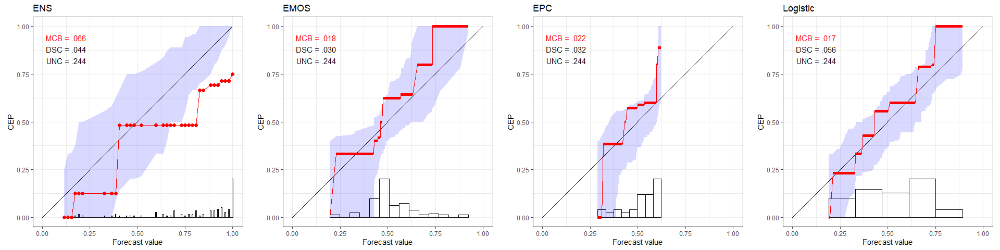
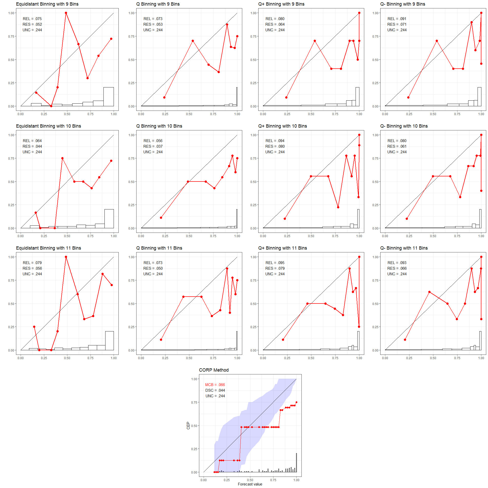

Plots in Supplementary Material
================

## Install packages

Install the `reliabilitydiag` package located in the root directory. The
`here` package identifies that directory by the location of the
replication\_DGJ20.Rproj file.

``` r
install.packages("here")
install.packages("devtools")
devtools::install_local(here::here("reliabilitydiag_0.1.1.tar.gz"))
```

### Required packages and compilation environment

``` r
library(here)
library(reliabilitydiag)
library(doParallel)
library(dplyr)
library(rlist)
library(purrr)
library(EnvStats)
library(ggplot2)
library(RColorBrewer)
library(ggExtra)
library(gridExtra)

sessionInfo()
```

    ## R version 4.0.3 (2020-10-10)
    ## Platform: x86_64-w64-mingw32/x64 (64-bit)
    ## Running under: Windows 10 x64 (build 19041)
    ## 
    ## Matrix products: default
    ## 
    ## locale:
    ## [1] LC_COLLATE=English_Germany.1252  LC_CTYPE=English_Germany.1252   
    ## [3] LC_MONETARY=English_Germany.1252 LC_NUMERIC=C                    
    ## [5] LC_TIME=English_Germany.1252    
    ## 
    ## attached base packages:
    ## [1] parallel  stats     graphics  grDevices utils     datasets  methods  
    ## [8] base     
    ## 
    ## other attached packages:
    ##  [1] gridExtra_2.3         ggExtra_0.9           RColorBrewer_1.1-2   
    ##  [4] ggplot2_3.3.2         EnvStats_2.4.0        purrr_0.3.4          
    ##  [7] rlist_0.4.6.1         dplyr_1.0.2           doParallel_1.0.16    
    ## [10] iterators_1.0.13      foreach_1.5.1         reliabilitydiag_0.1.1
    ## [13] here_0.1             
    ## 
    ## loaded via a namespace (and not attached):
    ##  [1] Rcpp_1.0.5        later_1.1.0.1     pillar_1.4.6      compiler_4.0.3   
    ##  [5] tools_4.0.3       digest_0.6.27     evaluate_0.14     lifecycle_0.2.0  
    ##  [9] tibble_3.0.4      gtable_0.3.0      pkgconfig_2.0.3   rlang_0.4.8      
    ## [13] shiny_1.5.0       yaml_2.2.1        xfun_0.18         fastmap_1.0.1    
    ## [17] withr_2.3.0       stringr_1.4.0     knitr_1.30        generics_0.1.0   
    ## [21] vctrs_0.3.4       rprojroot_1.3-2   grid_4.0.3        tidyselect_1.1.0 
    ## [25] data.table_1.13.2 glue_1.4.2        R6_2.5.0          rmarkdown_2.5    
    ## [29] magrittr_1.5      promises_1.1.1    backports_1.2.0   scales_1.1.1     
    ## [33] codetools_0.2-16  ellipsis_0.3.1    htmltools_0.5.0   xtable_1.8-4     
    ## [37] mime_0.9          colorspace_1.4-1  httpuv_1.5.4      miniUI_0.1.1.1   
    ## [41] stringi_1.5.3     munsell_0.5.0     crayon_1.3.4

## Section S1: Experimental data sets

### Plots for Fig S1

``` r
source("DGPs_DataDriven.R", local = knitr::knit_global())
```

<!-- --><!-- --><!-- -->

``` r
gridExtra::grid.arrange(p.SPF)
```

<!-- -->

## Section S2: (In)stability: Illustrative examples

### Plots for Fig S2–S5

``` r
source("Instabilities_QBinning.R", local = knitr::knit_global())
```

<!-- --><!-- --><!-- --><!-- -->

## Section S4: Uncertainty quantification: Data driven simulations

### Coverage simulations

The following source file performs an extensive simulation of the
coverage for the uncertainty quantification options: consistency,
confidence.

**Note:** Multiple hours of runtime. Only run if necessary to confirm
reproducibility.

``` r
source("sim_Coverage_Bands_DataDriven.R", local = knitr::knit_global())
```

### Plots for Fig S6–S9

``` r
source("fig_coverage.R", local = knitr::knit_global())
```

<!-- --><!-- --><!-- --><!-- -->

## Section S5: Statistical efficiency of CORP: Data driven simulations

### Efficiency simulations

The following source file performs an extensive simulation of the CORP
efficiency in comparison to various binning and counting approaches.

**Note:** Multiple hours of runtime. Only run if necessary to confirm
reproducibility.

``` r
source("sim_Efficiency_DataDriven.R", local = knitr::knit_global())
```

### Plots for Fig S10–S13

``` r
source("fig_efficiency.R", local = knitr::knit_global())
```

<!-- --><!-- --><!-- --><!-- -->

## Section S6: CORP discrimination diagrams

### Plots for Fig S14

``` r
source("DGPs_DataDriven_DSC.R", local = knitr::knit_global())
```

<!-- --><!-- --><!-- -->

``` r
gridExtra::grid.arrange(p.SPF)
```

<!-- -->
