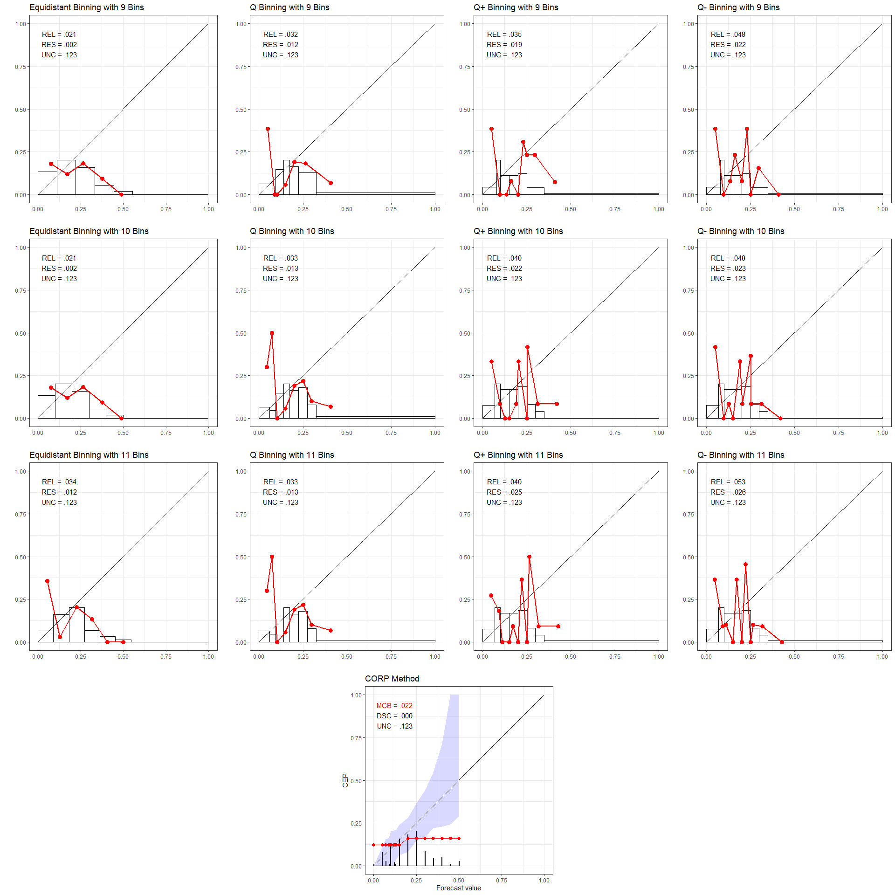
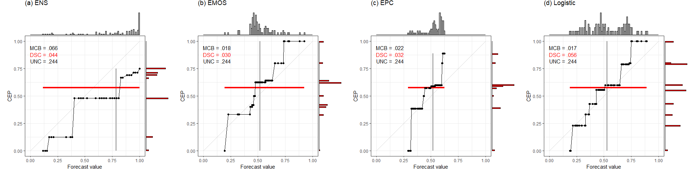

Plots in Supplementary Material
================

## Install packages

Install the `reliabilitydiag` package located in the root directory. The
`here` package identifies that directory by the location of the
replication\_DGJ20.Rproj file.

``` r
library(here)
devtools::install_local(here("reliabilitydiag_0.1.0.tar.gz"))
library(reliabilitydiag)
```

*Should we be providing frozen versions of all the packages that are
used?*

### Required packages and compilation environment

``` r
library(here)
library(rlist)
library(tibble)
library(EnvStats)
library(ggplot2)
library(dplyr)
library(doParallel)
library(RColorBrewer)
library(reshape2)
library(devtools)
library(ggExtra)
library(gridExtra)

sessionInfo()
```

    ## R version 4.0.3 (2020-10-10)
    ## Platform: x86_64-w64-mingw32/x64 (64-bit)
    ## Running under: Windows 10 x64 (build 19041)
    ## 
    ## Matrix products: default
    ## 
    ## locale:
    ## [1] LC_COLLATE=English_Germany.1252  LC_CTYPE=English_Germany.1252   
    ## [3] LC_MONETARY=English_Germany.1252 LC_NUMERIC=C                    
    ## [5] LC_TIME=English_Germany.1252    
    ## 
    ## attached base packages:
    ## [1] parallel  stats     graphics  grDevices utils     datasets  methods  
    ## [8] base     
    ## 
    ## other attached packages:
    ##  [1] gridExtra_2.3      ggExtra_0.9        devtools_2.3.2     usethis_1.6.3     
    ##  [5] reshape2_1.4.4     RColorBrewer_1.1-2 doParallel_1.0.16  iterators_1.0.13  
    ##  [9] foreach_1.5.1      dplyr_1.0.2        ggplot2_3.3.2      EnvStats_2.4.0    
    ## [13] tibble_3.0.4       rlist_0.4.6.1      here_0.1          
    ## 
    ## loaded via a namespace (and not attached):
    ##  [1] Rcpp_1.0.5        prettyunits_1.1.1 ps_1.4.0          assertthat_0.2.1 
    ##  [5] rprojroot_1.3-2   digest_0.6.27     mime_0.9          R6_2.5.0         
    ##  [9] plyr_1.8.6        backports_1.1.10  evaluate_0.14     pillar_1.4.6     
    ## [13] rlang_0.4.8       data.table_1.13.2 miniUI_0.1.1.1    callr_3.5.1      
    ## [17] rmarkdown_2.5     desc_1.2.0        stringr_1.4.0     munsell_0.5.0    
    ## [21] shiny_1.5.0       compiler_4.0.3    httpuv_1.5.4      xfun_0.18        
    ## [25] pkgconfig_2.0.3   pkgbuild_1.1.0    htmltools_0.5.0   tidyselect_1.1.0 
    ## [29] codetools_0.2-16  fansi_0.4.1       crayon_1.3.4      withr_2.3.0      
    ## [33] later_1.1.0.1     grid_4.0.3        xtable_1.8-4      gtable_0.3.0     
    ## [37] lifecycle_0.2.0   magrittr_1.5      scales_1.1.1      cli_2.1.0        
    ## [41] stringi_1.5.3     fs_1.5.0          promises_1.1.1    remotes_2.2.0    
    ## [45] testthat_2.3.2    ellipsis_0.3.1    generics_0.1.0    vctrs_0.3.4      
    ## [49] tools_4.0.3       glue_1.4.2        purrr_0.3.4       processx_3.4.4   
    ## [53] pkgload_1.1.0     fastmap_1.0.1     yaml_2.2.1        colorspace_1.4-1 
    ## [57] sessioninfo_1.1.1 memoise_1.1.0     knitr_1.30

## Section S1: Experimental data sets

### Required CRAN packages

  - rlist
  - tibble
  - EnvStats
  - ggplot2
  - dplyr
  - doParallel
  - RColorBrewer
  - reshape2
  - here

### Plots for Fig S1

``` r
source("DGPs_DataDriven.R", local = knitr::knit_global())
```

<!-- --><!-- --><!-- -->

``` r
gridExtra::grid.arrange(p.SPF)
```

<!-- -->

## Section S2: (In)stability: Illustrative examples

### Required CRAN packages

  - gridExtra
  - reliabilitydiag
  - here

### Plots for Fig S2–S5

``` r
source("Instabilities_QBinning.R", local = knitr::knit_global())
```

<!-- --><!-- --><!-- --><!-- -->

## Section S4: Uncertainty quantification: Data driven simulations

### Required CRAN packages

  - doParallel
  - dplyr
  - tibble
  - ggplot2
  - reliabilitydiag
  - here

### Plots for Fig S6–S9

The simulations are only rerun when the `runSimulations` variable in
`"sim_Coverage_Bands_DataDriven.R"` is `TRUE`.

``` r
source("sim_Coverage_Bands_DataDriven.R", local = knitr::knit_global())
```

<!-- --><!-- --><!-- --><!-- -->

## Section S5: Statistical efficiency of CORP: Data driven simulations

### Required CRAN packages

  - rlist
  - tibble
  - devtools
  - EnvStats
  - ggplot2
  - dplyr
  - doParallel
  - RColorBrewer
  - reshape2
  - reliabilitydiag
  - here

### Plots for Fig S10–S13

The simulations are only rerun when the `runSimulations` variable in
`"sim_Efficiency_DataDriven.R"` is `TRUE`.

``` r
source("sim_Efficiency_DataDriven.R", local = knitr::knit_global())
```

<!-- --><!-- --><!-- --><!-- -->

## Section S6: CORP discrimination diagrams

### Required CRAN packages

  - reliabilitydiag
  - dplyr
  - ggplot2
  - ggExtra
  - here

### Plots for Fig S14

``` r
source("discrimination_diagrams.R", local = knitr::knit_global())
```

<!-- -->
